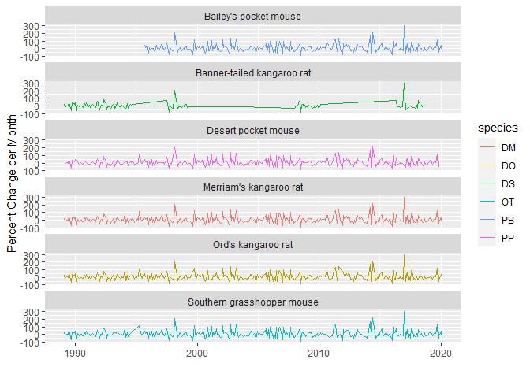
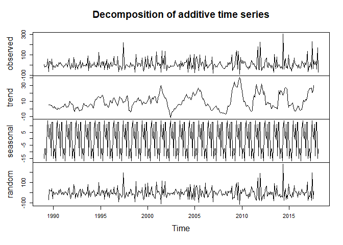
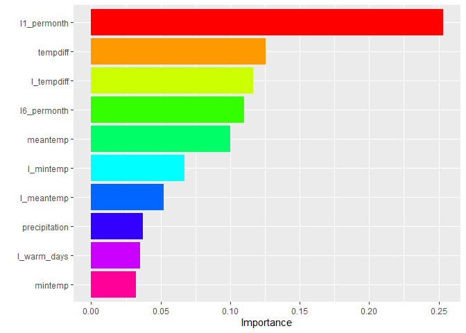
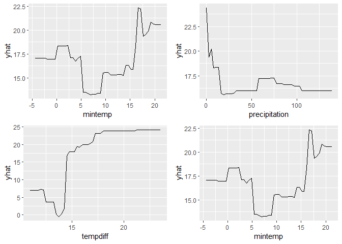
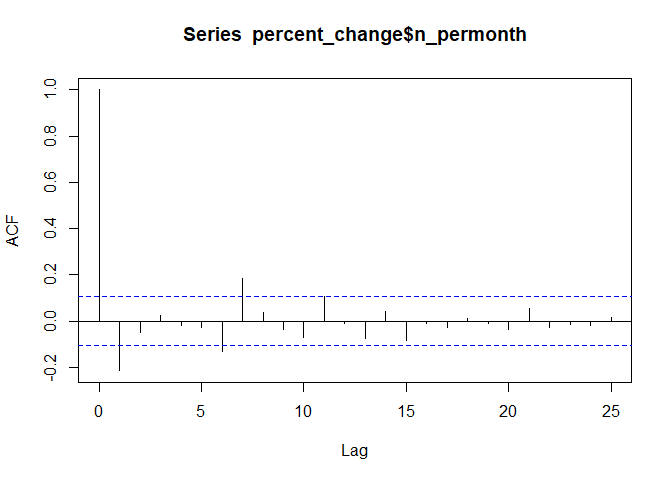

# Abstract

This paper explores a dataset of rodent populations in the Chihuahuan
desert near Portal, AZ and incorporates various climatological features
to predict percent changes in species diversity over time. A gradient
boosted tree model is utilized to forecast the response one period
ahead, treating forecasting as a supervised learning model. The boosted
model successfully predicts change in diversity one period ahead and
allows for demonstration of variables with the highest predictive value
for species diversity.

# Introduction

As climate changes drastically each year, the state of desert
environments is of particular interest. On one hand, deserts are
well-suited to environmental changes; extreme heat and drought,
monsoons, and large differences in daily temperatures between night and
day. But climate change is already threatening the state of natural
ecosystems, especially as Arizona faces one of lowest water supplies in
a century.

This analysis uses data from [The Portal
Project](https://portal.weecology.org/), where researchers have observed
an ecological site near Portal, AZ to study the effects of climate on
inhabitants within the desert ecosystem. Their observations include
those of different rodents, plants and insects as well as local weather
reports in this Chihuahuan desert setting. I chose to work with this
data because I am interested in how the desert will be impacted by
rising temperatures and changing weather patterns. This dataset is
useful in particular because it is an automated tracking system, so
there are few errors in records due to human error. In particular, it is
interesting to note that even during the beginning stages of the COVID
pandemic recording still continued. I’m not an ecologist and know very
little about ecology, but such a controlled environment of observation
is invaluable for tracking part of our world’s response to the changing
environment.

Additionally, I am interested in approaching time series forecasting
with the machine learning tools I have learned in the past semester.
Gradient boosted trees are popular with time series practitioners today,
and are practical substitutes for other complicated, time-series
specific statistical models. This paper seeks to find the best
predictive model for forecasting in a less traditional setting as is
usually seen in time series analysis, specifically, rodent populations.

# Methods

I am specifically working with the Portal Projects data on rodents and
weather. I created a variable `n_permonth` that measures the percent
change in unique species in the project ecosystem. This can be
interpreted as a “change in diversity” parameter. Included in the figure
below is the change in species counts over time for six different
species.

The six species plotted, excluding the Banner-tailed kangaroo rat, are
the 5 most frequently observed species in the dataset. I included the
Banner-tailed kangaroo because it went extinct around 2004 according to
the Portal researchers, with a resurgence just around 2010. It is
interesting to see here similarities in the peaks and troughs in the
population changes of these species. For example, all species except the
Desert pocket mouse show a spike in growth around 2017, while all six
species show a smaller, negative spike near 2009. An ecologist could
look at weather data around these times to give climatological context
as to what occurred to give such rises and falls in population.

## Working with time series data

Time series data are unique in that time itself is an important feature
in the outcome of the response variable. It is important to decompose
time series into seasonal and time trend components, as well as to
observe the part of the series that is truly random. In the appendix is
the plotted autocorrelation function of the response variable, which
appears to be an moving average process with statistical significance in
the first and sixth lags. Additionally, I include the decomposed
`n_permonth` series below.

As is expected, there is a strong seasonality component, but luckily the
data appear to be otherqise stationary. I remove the seasonality
component in the response variable to remove noise from seasonal trends.
Nearly all of the features included in the model have a seasonal
component (since they are weather variables), so I decompose them and
correct for seasonality as well.

## Gradient boosted tree model

After considering necessary modifications for working with time series
data, the features considered in the model are:

-   percent change per month, with lags by one period and by six periods

-   location[1]

-   minimum temperature (C)

-   maximum temperature (C)

-   difference between maximum and minimum temperature in the month

-   mean temperature (C)

-   precipitation

-   number of warm days

-   one period lags for all weather variables

I fit a gradient boosted regression tree to investigate the effect of
all features on the percent change in diversity parameter. The data is
split into training and testing subsets, with 80% of the data going to
training and 20% going to testing for assessment of the accuracy of the
model. I then create a tuning grid to choose the best hyperparameters
for the boosted model, which are summarized in the results section.
Using a cross-validated approach, the in-sample RMSE is calculated as
the average of the predictions from 5 folds of the training data. The
out-of-sample RMSE is calculated last using the testing data.

The goal of this analysis is to forecast one period ahead by using a
lagged value of the outcome variable in the set of features.
Additionally, the nonparametric approach of a tree-based method allows
us to estimate using a multivariate set of features, whereas in a
traditional statistical approach we would have to place many limiting
restrictions on model structure.

# Results

The optimal tree parameters found by a cross-validated tuning grid are
summarized in the appendix. The first two tables display the in-sample
and out-of-sample prediction error of the optimized boosted tree model.
Finally, I include variable importance plots and partial dependence
plots to explore the boosted tree’s predictions.

<table>
<thead>
<tr class="header">
<th style="text-align: left;">Metric</th>
<th style="text-align: right;">Mean CV Estimate</th>
<th style="text-align: right;">Number of folds</th>
<th style="text-align: right;">Standard Error</th>
</tr>
</thead>
<tbody>
<tr class="odd">
<td style="text-align: left;">rmse</td>
<td style="text-align: right;">4.68e-05</td>
<td style="text-align: right;">5</td>
<td style="text-align: right;">1.8e-06</td>
</tr>
</tbody>
</table>

<table>
<thead>
<tr class="header">
<th style="text-align: left;">Metric</th>
<th style="text-align: right;">Out-of-Sample Estimate</th>
</tr>
</thead>
<tbody>
<tr class="odd">
<td style="text-align: left;">rmse</td>
<td style="text-align: right;">4.24e-05</td>
</tr>
</tbody>
</table>

# Conclusion

The boosted model exceeded expectations in its prediction accuracy. The
in-sample and out-of-sample RMSE are significantly low, considering that
the standard deviation of the response variable is about 47, or a 47%
change in species diversity. Looking at the variable importance plot, we
notice that the lagged response variable, obviously, is most important,
but that many other of the features are important predictors as well.
Notably, lagged minimum temperature is second most important, meaning
that while desert organisms may be well-accustomed to high temperatures,
low temperatures can cause disparities between the population of one
period to the next. Precipitation and max temperature are least
important, probably because desert climates are accustomed to periods of
drought and extreme heat. Climate change does not only mean less rain
and more sun, but can imply more extreme fluctuations in temperature as
well.

The gradient boosted model served well in forecasting one-period ahead
percent changes in species diversity. For further research, this model
could be expanded to include the ecosystem’s plant diversity as features
since rodents depend on these plants for sustenance. I have included
partial dependence plots in the appendix, but these were a bit difficult
to interpret.[2] This analysis might be further supported with other
measures of representing marginal dependence such as ICE plots.
Additionally, this model could be expanded to forecast ahead even more
periods; one period ahead is doable in many cases. I am pleased with the
results of the model, but in the future would expand the analysis to
include forecasting of several periods ahead.

## Appendix

### Boosted Tree Hyperparamters

<table>
<caption>Model parameters selected by tuning</caption>
<thead>
<tr class="header">
<th style="text-align: right;">Tree Depth</th>
<th style="text-align: right;">Learn Rate</th>
<th style="text-align: right;">Sample Size</th>
</tr>
</thead>
<tbody>
<tr class="odd">
<td style="text-align: right;">15</td>
<td style="text-align: right;">0.3162278</td>
<td style="text-align: right;">1</td>
</tr>
</tbody>
</table>

Model parameters selected by tuning

### Partial Dependence Plots

### Autocorrelation function of response variable

[1] Relative location in the observation area, which is divided into 66
different “stakes” numbered from 11 to 77.

[2] The response variable includes a significant amount of percentages
below zero, but the predicted response as a function of all the
variables chosen show positive growth levels only.
